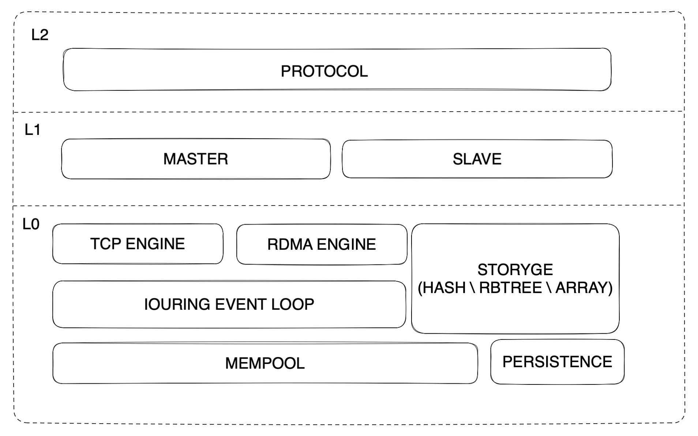

# 9.1 Kvstore
## run
```shell
git clone https://github.com/cktan/tomlc99.git deps/tomlc99
git clone https://github.com/wangbojing/NtyCo.git deps/ntyco

make

./kvstore 2000
```

### 面试题
1. 为什么会实现kvstore，使用场景在哪里？
2. reactor, ntyco, io_uring的三种网络模型的性能差异？
3. 多线程的kvstore该如何改进？
4. 私有协议如何设计会更加安全可靠？
5. 协议改进以后，对已有的代码有哪些改变？
6. kv引擎实现了哪些？
7. 每个kv引擎的使用场景，以及性能差异？
8. 测试用例如何实现？并且保证代码覆盖率超过90%
9. 网络并发量如何？qps如何？
10. 能够跟哪些系统交互使用？


### 架构设计



### proactor

用户需要定义
```c
struct kvs_conn_s;
struct kvs_server_s {
    int (*on_accept)(struct kvs_server_s *server, int connfd);
    int (*on_msg)(struct kvs_conn_s *conn);
    int (*on_send)(struct kvs_conn_s *conn);
    int (*on_close)(struct kvs_conn_s *conn);
    struct kvs_conn_s *conns;
    int port; // 用户填写想要监听的端口
    int server_fd; // 框架自动初始化
    struct io_uring *uring; // 框架自动初始化

    // 用户自定义参数..
}

struct kvs_conn_s {
    int fd;
	char* r_buffer;
	int r_buf_sz;
    int r_idx;
	char* response;
	int s_buf_sz;
    int s_idx;

    // 用户自定义参数..
};
```
提供接口
```c
int kvs_proactor_start(struct kvs_server_s *server);
int set_event_send(struct io_uring *ring, int sockfd, void *buf, size_t len, int flags);
int set_event_recv(struct io_uring *ring, int sockfd, void *buf, size_t len, int flags);
```

用法
```c
struct kvs_server_s server;
memset(&server, 0, sizeof(struct kvs_server_s))
server.on_accept = on_accept;
server.on_msg = on_msg;
server.on_send = on_send;
server.conns = (struct kvs_conn_s*)malloc(sizeof(struct kvs_conn_s) * CONN_MAX_SIZE);
server.port = 9527;
kvs_proactor_start(&server);
```

### 性能测试
```shell
sudo perf record  -p 681498 -g -- sleep 10
./test/test_aof_hash 127.0.0.1 2000 1 50000000
```
result
```shell
+   27.86%    14.08%  kvstore  kvstore            [.] kvs_hash_resp_set                                           
+   11.80%    11.77%  kvstore  [kernel.kallsyms]  [k] __wake_up    


--- HSET Results ---
Total Time:     2.526 seconds
Success Count:  5000000
Actual QPS:     1979670.37
--------------------
```

### 内存池性能对比
如果用posix_memaligan分配内存的话，一定不要4K对齐，这玩意分配内存之前要几个byte的空间存这次分配内存的大小信息等等，
要是4K对齐的话，第一次分配可能问题不大，因为此时堆指针还没4k对齐，下一次分配时那就炸了，
因为此刻堆指针是4K对齐的，然后这玩意又需要存一点信息，那就不得不用掉8K的物理内存，
前面一个4K的物理内存后8或16个字节存信息，后面的4K才是给用户的.我说为什么当时jemalloc的物理内存占用比我小一半
原来是我每次分配4K都用掉了8K


```shell
key:11bytes value:21bytes  500w HSET
malloc      | 2023916.21 qps | 620M VIRT | 545M RES
kvs_mempool | 1984553.03 qps | 469M VIRT | 394M RES
jemalloc    | 1989839.09 qps | 509M VIRT | 402M RES
```

```shell
key:8bytes value:8bytes    500w HSET
malloc      | 2199975.10 qps | 620M VIRT | 545M RES
kvs_mempool | 2060713.57 qps | 316M VIRT | 241M RES
jemalloc    | 2151554.65 qps | 335M VIRT | 246M RES
```

### rdma
```
$ sudo ufw disable
$ sudo modprobe siw
$ sudo rdma link add siw0 type siw netdev <网卡名>
$ ibv_devices
```

### iouring异步

1. iouring在内核中是并行执行的

README 电脑各项配置信息、虚拟机的系统版本 编译步骤，测试方案与可行性，性能数据

实现配置文件，包含端口ip，日志级别，持久化方案，主从同步 等的配置，在配置文件中配置

aof、rdb文件落盘用io_uring,加载持久化文件用mmap

主从同步用ebpf

发rdb文件，调研rdma实现。