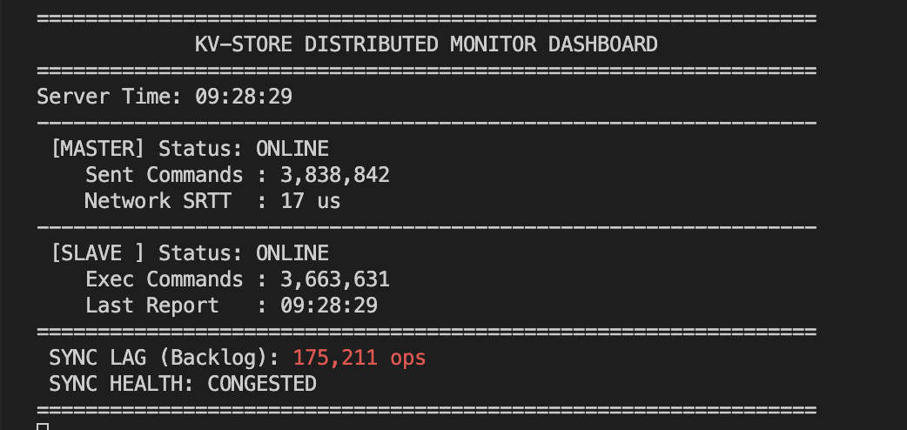

# 9.1 Kvstore
## run
```shell
mkdir build 
cd build
cmake ..
make

sudo modprobe siw
sudo rdma link add siw0 type siw netdev <网卡名>

./kvstore ./kvs.toml
```

## 架构


## 测试环境
- 宿主机环境：
    - 硬件：macOS M3PRO 
    - 软件：Tahoe 26.2 
- 虚拟机环境 
    - 虚拟机载体：VMware Fusion Professional Version 13.6.1 (24319021) 
    - linux版本：Ubuntu 24.04.3 LTS
    - 分配内存：4GB
    - 分配核心：6 processer cores


## 性能测试
### redis-benchmark pipeline
关闭aof


### rdb
```shell
redis-benchmark -h 172.16.135.130 -p 2000 -t set -n 5000000 -P 10
```

| **save 触发阈值** | **SET QPS**  | **相比 1000 提升** | **相比 1000000 下降** |
| ----------------- | ------------ | ------------------ | --------------------- |
| 1000              | 1,893,222.25 | baseline           | 15.06%                |
| 10000             | 1,926,040.12 | +1.73%             | 13.60%                |
| 100000            | 2,091,175.25 | +10.45%            | 6.19%                 |
| 1000000           | 2,229,157.25 | +17.74%            | baseline              |

### aof

```shell
# 2000000条set，500 pipeline
./test/test_hash <ip> <port> 1 5000000
````
echo: 7479107.11

| **系统** | **关闭 AOF QPS** | **开启 AOF everysec QPS** | **下降 QPS** | **下降比例** | **保留性能** |
| -------- | ---------------- | ------------------------- | ------------ | ------------ | ------------ |
| KVStore  | 2,710,486.19     | 2,186,143.57              | 524,342.62   | **19.34%**   | 80.66%       |
| Redis    | 1,736,368.85     | 1,253,161.88              | 483,206.97   | **27.83%**   | 72.17%       |

同步写：1312486.67


### rdma vs. sendfile 
mtu 1500
[client] connected to 172.16.135.130:2000
[client] input file: test_2g.dat
[client] file size: 2147483648 bytes
[client] sent 2048.00 MiB
[client] sent final chunk
[client] done
[client] total bytes: 2147483648
[client] elapsed: 4.133 sec
[client] throughput: 495.53 MiB/s


[server] listening on 172.16.135.130:2000
[server] connection established
[server] received 2048.00 MiB
[server] received FIN chunk
[server] done
[server] total bytes: 2147483648
[server] elapsed: 4.426 sec
[server] throughput: 462.69 MiB/s

mtu 9000
[server] listening on 172.16.135.130:2000
[server] connection established
[server] received 2048.00 MiB
[server] received FIN chunk
[server] done
[server] total bytes: 2147483648
[server] elapsed: 2.789 sec
[server] throughput: 734.19 MiB/s

[client] connected to 172.16.135.130:2000
[client] input file: test_2g.dat
[client] file size: 2147483648 bytes
[client] sent 2048.00 MiB
[client] sent final chunk
[client] done
[client] total bytes: 2147483648
[client] elapsed: 2.730 sec
[client] throughput: 750.11 MiB/s


mtu 1500

mtu 9000


### redis-benchmark
测试策略：使用redis-benchmark测试，测试500w次SET命令，关闭持久化。
redis结果如下：
```shell
# redis
$ redis-benchmark -h 127.0.0.1 -p 6379 -t set -n 5000000 -P 500 -q
SET: 3927729.75 requests per second, p50=5.631 msec  

# kvstore
$ redis-benchmark -h 172.16.135.130 -p 2000 -t set -n 5000000 -P 500 -q
SET: 7363770.00 requests per second, p50=2.919 msec
```


```shell
# redis
$ redis-benchmark -h 127.0.0.1 -p 6379 -t set -n 5000000 -P 1 -q
SET: 275118.31 requests per second, p50=0.095 msec 

# kvstore
$ redis-benchmark -h 172.16.135.130 -p 2000 -t set -n 5000000 -P 1 -q
SET: 228592.34 requests per second, p50=0.119 msec     
```
在高并发下 QPS 达到 736万，超越 Redis (392万) 约 87%，充分释放 io_uring 的批量处理能力。
在单指令交互（Pipeline=1）场景下，性能与 Redis 处于同一数量级，延迟仅有微小差距。

### 自定义测试脚本
测试策略：进行500w次管道化的SET操作，一次性写入500w个不同的KEY，并开启持久化。

```shell
$ sudo perf record  -p 681498 -g -- sleep 10
$ ./test/test_hash 172.16.135.130 2000 1 5000000

+   27.86%    14.08%  kvstore  kvstore            [.] kvs_hash_resp_set                                           
+   11.80%    11.77%  kvstore  [kernel.kallsyms]  [k] __wake_up    
```
业务代码本身只占27.86%CPU时间

```shell
$ ./test/test_hash 172.16.135.130 2000 1 5000000

--- HSET Results ---
Total Time:     2.526 seconds
Success Count:  5000000
Actual QPS:     1979670.37
--------------------
```


### 内存性能测试
测试策略：进行500w次管道化的SET操作，一次性写入500w个不同的KEY。
```shell
key:11bytes value:21bytes  500w HSET
malloc      | 2023916.21 qps | 620M VIRT | 545M RES
kvs_mempool | 1984553.03 qps | 469M VIRT | 394M RES
jemalloc    | 1989839.09 qps | 509M VIRT | 402M RES
```

```shell
key:8bytes value:8bytes    500w HSET
malloc      | 2199975.10 qps | 620M VIRT | 545M RES
kvs_mempool | 2060713.57 qps | 316M VIRT | 241M RES
jemalloc    | 2151554.65 qps | 335M VIRT | 246M RES
```

### 持久化
测试策略：进行500w次管道化的SET操作，一次性写入500w个不同的KEY。

```shell
# alway 策略结果：
--- SET Results ---
Total Time:     2.621 seconds
Success Count:  5000000
Actual QPS:     1907322.44
--------------------

# very second 策略结果：
--- SET Results ---
Total Time:     2.546 seconds
Success Count:  5000000
Actual QPS:     1963904.23
--------------------
```


### 性能测试分析


## 主从同步
### RDMA
分布式 KV 在主从全量同步时，TB 级的 RDB 文件传输会导致严重的 CPU 占用和网络 IO 瓶颈，传统 TCP 模式下内核态与用户态的多次拷贝显著增加了同步时长。

KVstore实现了一种高性能、零拷贝的 RDB 传输机制，并解决了 RDMA 在高速传输中极易触发的 RNR (Receiver Not Ready) 硬件错误。

基于 RDMA CMA/Verbs 开发了纯异步传输引擎，利用 Zero-Copy 绕过内核协议栈。
设计并实现了一套基于信用的反压机制 (Backpressure)。Slave 动态向 Master 授权“信用额度（Buffer 数量）”，Master 严格按额度发送。
有效解决了RNR错误的发生

### EBPF
使用ebpf监测主从增量同步的进度
```shell
$ git clone --recursive https://github.com/libbpf/libbpf-bootstrap.git
$ cp ./ebpf/kvs* ./libbpf-bootstrap/examples/c/
$ cd ./libbpf-bootstrap/examples/c/
# 在./libbpf-bootstrap/examples/c/makefile的APPS中加上kvs_monitor
$ make kvs_monitor
$ cd ../../../

$ python3 ./ebpf/monitor_server.py
$ cd  ./libbpf-bootstrap/examples/c/
$ sudo ./kvs_monitor <PID> m 0 2000 127.0.0.1 9090
$ sudo ./kvs_monitor <PID> s 0 2004 127.0.0.1 9090
$ ./test/test_hash <ip> <port> 1 500000
```



