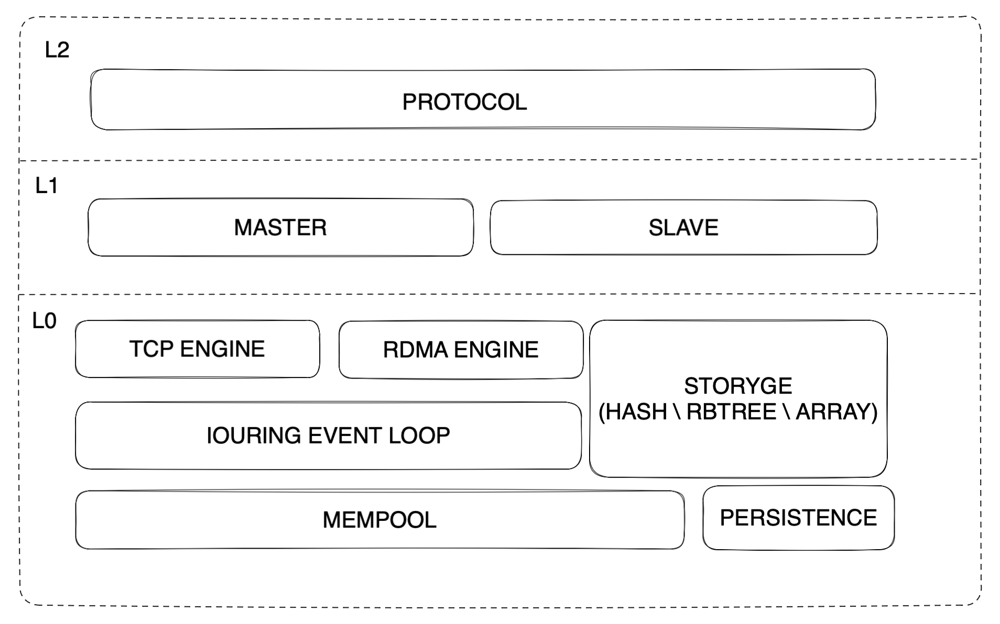
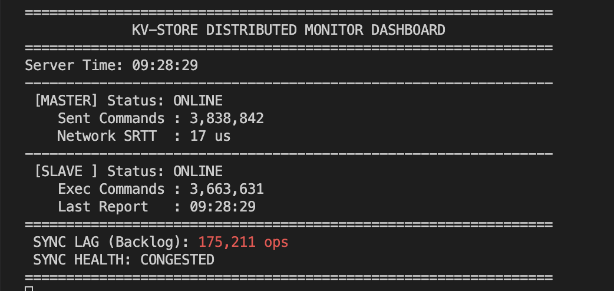

# 9.1 Kvstore
## run
```shell
mkdir build 
cd build
cmake ..
make

sudo modprobe siw
sudo rdma link add siw0 type siw netdev <网卡名>

./kvstore ./kvs.toml
```

## 架构


## 测试环境
- 宿主机环境：
    - 硬件：macOS M3PRO 
    - 软件：Tahoe 26.2 
- 虚拟机环境 
    - 虚拟机载体：VMware Fusion Professional Version 13.6.1 (24319021) 
    - linux版本：Ubuntu 24.04.3 LTS
    - 分配内存：4GB
    - 分配核心：6 processer cores
- redis version: Redis 6.2.21 (578ac274/1) 64 bit


## 性能测试

### redis-benchmark set

1. 单客户端 / 单线程
```shell
# -r代表在1~keylen范围内随机key，如果不加入随机key，那么会一直插入同一个key
redis-benchmark -h <ip> -p <port>  -t set -n 5000000 -q -r 5000000 -P 10
```
| **Pipeline** | **Redis QPS** | **Redis p50** | **KVStore QPS** | **KVStore p50** | **KVStore / Redis** |
| ------------ | ------------- | ------------- | --------------- | --------------- | ------------------- |
| 10           | 1,161,440.25  | 0.367 ms      | 2,374,169.00    | 0.127 ms        | 2.04×               |
| 20           | 1,402,524.50  | 0.623 ms      | 3,511,236.00    | 0.207 ms        | 2.50×               |
| 40           | 1,435,956.25  | 1.247 ms      | 4,401,408.50    | 0.375 ms        | 3.07×               |
| 80           | 1,532,332.25  | 2.359 ms      | 4,775,549.00    | 0.735 ms        | 3.12×               |
| 160          | 1,549,426.75  | 4.663 ms      | 4,950,495.00    | 1.463 ms        | 3.20×               |

2. 10 clients + 10 benchmark threads
```shell
redis-benchmark -h <ip> -p <port>  -t set -n 5000000 -q -r 5000000 -c 10 --threads 10 -P 10
```
| **Pipeline** | **Redis QPS** | **Redis p50** | **KVStore QPS** | **KVStore p50** | **KVStore / Redis** |
| ------------ | ------------- | ------------- | --------------- | --------------- | ------------------- |
| 10           | 868,809.69    | 0.103 ms      | 1,427,755.50    | 0.063 ms        | 1.64×               |
| 20           | 1,109,877.88  | 0.167 ms      | 2,219,263.25    | 0.079 ms        | 2.00×               |
| 40           | 1,331,203.38  | 0.271 ms      | 3,328,894.75    | 0.111 ms        | 2.50×               |
| 80           | 1,426,533.50  | 0.495 ms      | 3,987,241.00    | 0.183 ms        | 2.80×               |
| 160          | 1,533,272.00  | 0.903 ms      | 3,996,802.50    | 0.335 ms        | 2.61×               |

3. echo
```shell
redis-benchmark -h <ip> -p <port>  -n 5000000 -P 1 -q echo hello
```

| 系统 | 命令 | Pipeline | 请求数 | QPS | p50 延迟 | 相对 Redis |
|---|---|---:|---:|---:|---:|---:|
| Redis | `ECHO hello` | 1 | 500,000 | 293,255.12 | 0.087 ms | 1.00× |
| KVStore | `ECHO hello` | 1 | 500,000 | 274,423.72 | 0.095 ms | 0.94× |

### rdb
```shell
redis-benchmark -h 172.16.135.130 -p 2000 -t set -n 5000000 -P 10
```

| **save 触发阈值** | **SET QPS**  | **相比 1000 提升** | **相比 1000000 下降** |
| ----------------- | ------------ | ------------------ | --------------------- |
| 1000              | 1,893,222.25 | baseline           | 15.06%                |
| 10000             | 1,926,040.12 | +1.73%             | 13.60%                |
| 100000            | 2,091,175.25 | +10.45%            | 6.19%                 |
| 1000000           | 2,229,157.25 | +17.74%            | baseline              |

### aof
```shell
redis-benchmark -h <ip> -p <port>  -t set -n 5000000 -q -P 20
```

#### 1. `pipeline=20 -n 5000000`

| 系统 | 关闭 AOF QPS | 开启 AOF everysec QPS | QPS 下降 | 下降比例 | 性能保留 |
|---|---:|---:|---:|---:|---:|
| **KVStore** | **4,184,100.25** | **4,115,226.25** | **68,874.00** | **1.65%** | **98.35%** |
| Redis | 3,092,146.00 | 1,952,362.25 | 1,139,783.75 | 36.86% | 63.14% |

#### 2. `-r 5000000 -n 5000000`

| Pipeline | 系统 | 关闭 AOF QPS | 开启 AOF everysec QPS | QPS 下降 | 下降比例 | 性能保留 |
|---:|---|---:|---:|---:|---:|---:|
| 10 | **KVStore** | **2,374,169.00** | **2,175,805.00** | **198,364.00** | **8.36%** | **91.64%** |
| 10 | Redis | 1,123,343.00 | 859,549.62 | 263,793.38 | 23.48% | 76.52% |
| 20 | **KVStore** | **3,427,004.75** | **2,958,579.75** | **468,425.00** | **13.67%** | **86.33%** |
| 20 | Redis | 1,368,363.38 | 1,077,586.25 | 290,777.13 | 21.25% | 78.75% |


### rdma vs. sendfile 
#### 阿里云
测试环境为阿里云 eRDMA 双实例，RDMA 设备为 `erdma_0`，链路层为 Ethernet。TCP 测试使用内网 IP，RDMA 测试通过 RDMA CM 建立连接。MTU为8500。

| 测试项 | 测试方式 | 数据量 / 参数 | 平均吞吐 | 约合带宽 |
|---|---|---:|---:|---:|
| TCP `iperf3` | 单连接 TCP | 10s | - | 26.3 Gbit/s |
| TCP `sendfile` | client `sendfile()`，server `recv discard` | 4 GiB | 3359.68 MiB/s | 28.18 Gbit/s |
| RDMA WRITE | memory buffer → RDMA WRITE → server discard | 2–4 GiB | 约 3100–3160 MiB/s | 约 26 Gbit/s |
| RDMA READ  | RDMA READ，1MiB chunk  | 4 GiB | 约 3161.44 MiB/s | 约 26.52 Gbit/s |
| `ib_read_bw`  | RDMA READ，1MiB × 4096 | 4 GiB | 3161.43 MB/s | 25.29 Gbit/s |

#### 本地虚拟机
测试环境说明：
- 测试方式：两台虚拟机之间传输 `test_2g.dat`
- 文件大小：2048 MiB
- RDMA 实现：Soft-iWARP（siw）
- 传输模式：RDMA_WRITE + token/window + O_DIRECT pread
- RDMA buffer size：8 MiB
- token count：4
- chunk 数量：256
- MTU：9000


| 测试项 | 测试方式 | 数据量 / 参数 | 平均吞吐 | 约合带宽 |
|---|---|---:|---:|---:|
| TCP `iperf3` | 单连接 TCP | 10s | 约 59.5 MiB/s | 499 Mbit/s |
| TCP `sendfile` | client `sendfile()`，server `recv discard` | 2 GiB | 59.03 MiB/s | 约 495 Mbit/s |
| RDMA WRITE，MTU 1500 | `O_DIRECT pread` → RDMA WRITE → server discard，token/window | 2 GiB，8 MiB buffer，token=4 | 53.46 MiB/s | 约 448 Mbit/s |
| RDMA READ | RDMA READ memory, 1 MiB chunk，depth=100 | 2 GiB | 51.93 MiB/s | 约 436 Mbit/s |
| RDMA WRITE，MTU 9000 | `O_DIRECT pread` → RDMA WRITE → server discard，token/window | 2 GiB，8 MiB buffer，token=4 | 52.75 MiB/s | 约 442 Mbit/s |

| MTU | 耗时 | 吞吐量 | 说明 |
|---:|---:|---:|---|
| 1500 | 38.306 s | 53.46 MiB/s | 原始测试结果 |
| 9000 | 38.824 s | 52.75 MiB/s | 调整 MTU 后结果 |

### 内存池

```
key:11bytes value:21bytes  500w SET
./test_hash 172.16.135.130 2000 1 5000000 500
```
| **内存池**  | **SET QPS** | **插入前 VIRT** | **插入前 RES** | **插入后 VIRT** | **插入后 RES** | **删除后 VIRT** | **删除后 RES** |
| ----------- | ------------ | --------------- | -------------- | --------------- | -------------- | --------------- | -------------- |
| malloc      | 2,442,669.33 | 74.71 MiB       | 47.52 MiB      | 610 MiB         | 581 MiB        | 610 MiB         | 581 MiB        |
| jemalloc    | 2,639,330.24 | 104 MiB         | 49.93 MiB      | 573 MiB         | 438 MiB        | 573 MiB         | 58.82MiB    |
| kvs_mempool | 2,795,660.69 | 74.71 MiB       | 47.54 MiB      | 459 MiB         | 430 MiB        | 459 MiB         | 430 MiB        |


## EBPF
### tc forwards
```shell
./build/ebpf/tc_forwarder <ifname> <master_port> <listen_ip> <listen_port>\n


./build/kvstore ./build/kvs.toml
sudo ./build/ebpf/tc_forwarder ens161 2000 172.16.135.130 3000
./test_slave/kvstore ./test_slave/kvs.toml
./test/test_hash 172.16.135.130 2000 1 2000000
./test/test_hash 172.16.135.130 2004 2 2000000
```

```
./test/test_hash 172.16.135.130 2000 1 200000 1 
```
tc qps :     38520.92
nornmal qpas : 60874.50


### 可观测
使用ebpf监测主从增量同步的进度
```shell
$ git clone --recursive https://github.com/libbpf/libbpf-bootstrap.git
$ cp ./ebpf/kvs* ./libbpf-bootstrap/examples/c/
$ cd ./libbpf-bootstrap/examples/c/
# 在./libbpf-bootstrap/examples/c/makefile的APPS中加上kvs_monitor
$ make kvs_monitor
$ cd ../../../

$ python3 ./ebpf/monitor_server.py
$ cd  ./libbpf-bootstrap/examples/c/
$ sudo ./kvs_monitor <PID> m 0 2000 127.0.0.1 9090
$ sudo ./kvs_monitor <PID> s 0 2004 127.0.0.1 9090
$ ./test/test_hash <ip> <port> 1 500000
```



